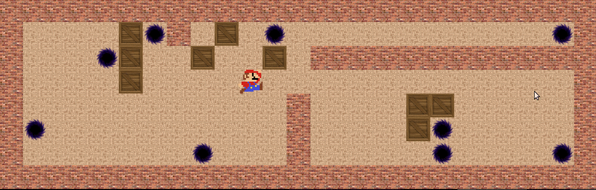

# Sokoban

### Demo :


### Use of Shell version :
```
$ make re
$ ./sokoban <Map File>
```

### Use of Graphical version :
```
$ cd bonus/
$ make re
$ ./sokoban <Map File>
```

### Project Informations :

Sokoban is a video game develop in japan.
The goal of this project is to develop a copy of this game in terminal mode, using the ncurses library.

As bonus, the game as also been implement with csfml graphical library.

It had been coded following Epitech's standart.

More informations in sokoban.pdf.
